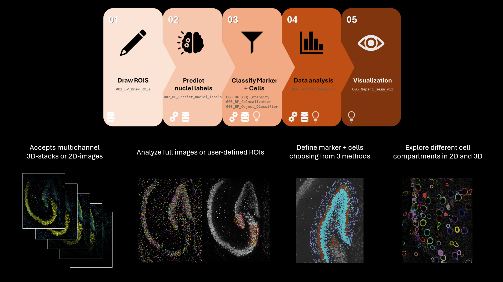
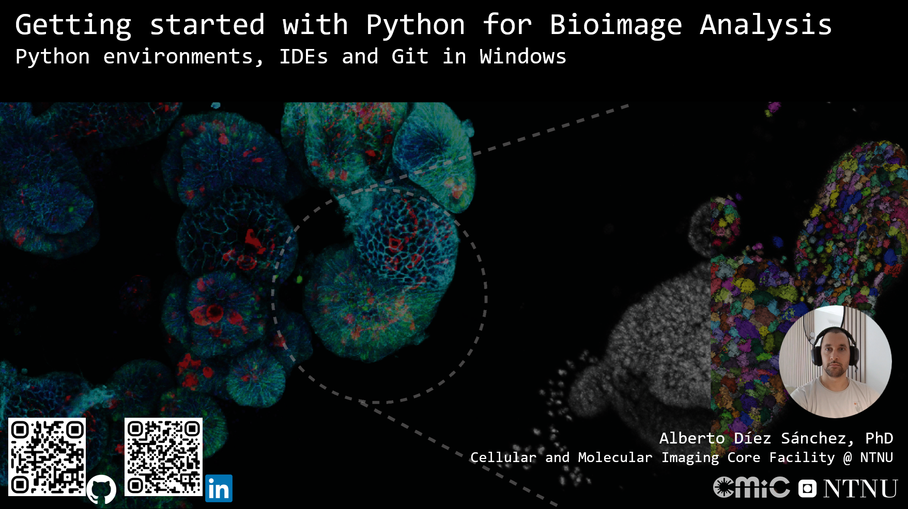
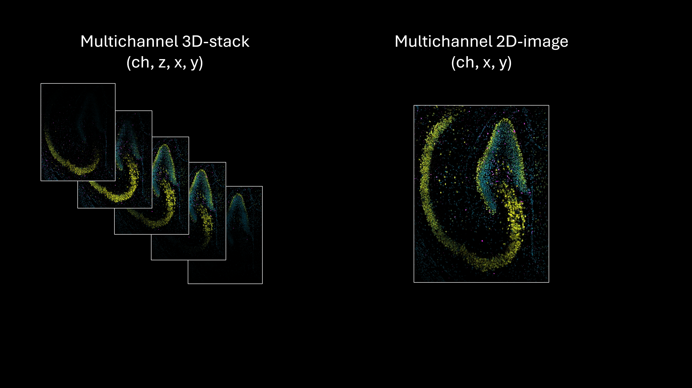
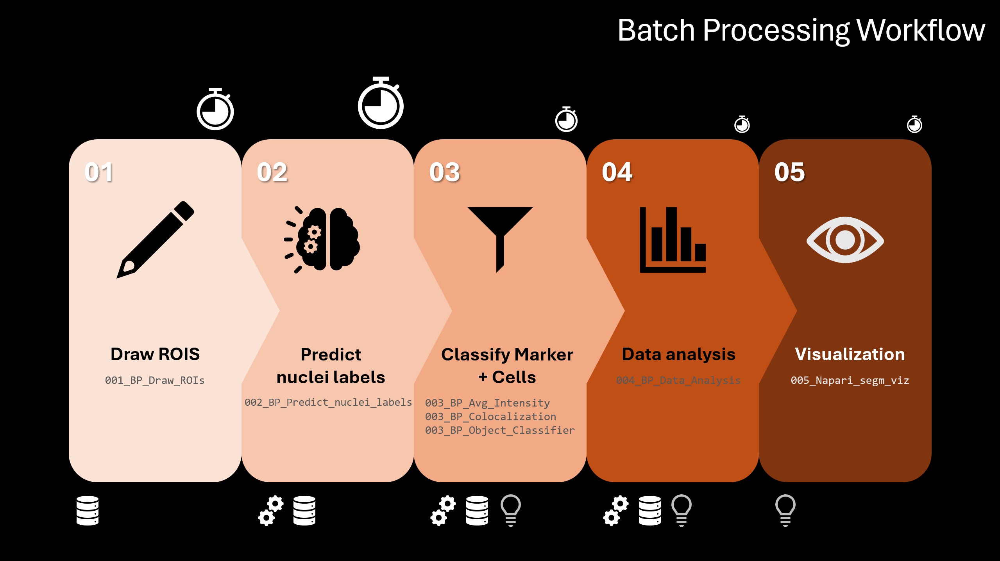
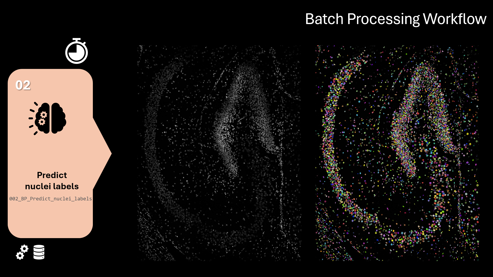

<h1>Nuclear Segmentation Utility for Brain and Organoid fluorescent samples (NEUROSEG) - Identify marker positive cells based on fluorescence intensity</h1>

This repository provides tools in the form of interactive **Jupyter Notebooks** to define **cell populations** based on the presence or absence of **multiple fluorescent markers** in **multichannel 3D-stacks or 2D-images**. 

Analysis can be performed on the **whole image** (default) or on **multiple user-defined ROIs**. It also allows you to extract average marker intensity signal from nucleus and cytoplasm to easily calculate nuclear translocation ratios.

## What can this pipeline do for me?

Watch the video series below to learn how to set up the required tools, explore the capabilities of the pipeline, and understand how to use it effectively.

|  | Watch on YouTube | Description |
|-------|------------------|-------------|
|  | [Pipeline installation using Pixi](https://youtu.be/tzdFuxF2E3U) | TL;DR You are busy in the wet lab and want to get your hands on in this tool and start using it ASAP.  |
|  | [Before you start (Python, IDE and Git on Windows)](https://youtu.be/tzdFuxF2E3U) | If you are not familiar with Python, Virtual Environments, Integrated Developer Environments (IDEs) or version control this is the place to start. In this video we will cover how to configure your Windows machine to be able to run this pipeline  |
|  | [Intro and functionalities](https://youtu.be/lJU8cnHMmPg) | Introduction and showcase to the image analysis functionalities of the NEUROSEG Jupyter Notebook collection. Includes an explanation of the 3 available methods to define marker positive cells |
|  | [Pipeline Workflow](https://www.youtube.com/watch?v=O70ggeeQxPs) | Walkthrough of the pipeline workflow: where to start, the order in which to run each notebook, and what steps to take before batch processing your images  |
|  | [Steps 1 & 2 - ROI Definition and Nuclei Prediction](https://www.youtube.com/watch?v=wEq5PkbctSY) | Defining your regions of interest to analyze (ROIs), generating nuclei labels from your input images and alternative workflows (full_image prediction first, and ROI after) Notebooks covered: **`001_BP_Draw_ROIs.ipynb`** **`002_SP_Predict_nuclei_labels.ipynb`** **`002_BP_Predict_nuclei_labels.ipynb`** **`002_BP_ROI_on_full_image_nuclei_labels.ipynb`** |
|  | [Step 3.1 - Defining Marker Positive Cells - Average Intensity](https://www.youtube.com/watch?v=VIDEO_ID_4) | Method 1: Define positive cells for a marker based on the **average intensity** of each marker within the nucleus, the cytoplasm or the whole cell. A cell is considered **positive** if the average intensity falls within the **user-defined min and max thresholds**. Choose **`000_SP_Avg_Intensity.ipynb`** & **`003_BP_Avg_Intensity.ipynb`**. |
|  | [Step 3.2 - Defining Marker Positive Cells - Pixel Intensity](https://www.youtube.com/watch?v=VIDEO_ID_4) | Method 2: Useful method to remove bright unspecific spots that cause false positive marker cells. Based on colocalization and morphological operations. Choose **`000_SP_Colocalization.ipynb`** & **`003_BP_Colocalization.ipynb`**. |
|  | [Step 3.3 - Defining Marker Positive Cells - APOC Object Classifier](https://www.youtube.com/watch?v=VIDEO_ID_4) | Method 3: Train an **object classifier** using **signal intensity features** by painting on top of a few sample objects in **Napari** using **`!_APOC_Obj_Class_training.ipynb`**. After training the object classifier run **`000_SP_Object_Classifier.ipynb`** & **`003_BP_Object_Classifier.ipynb`**. |
|  | [Steps 4 & 5 - Data Analysis and QC Visualization](https://www.youtube.com/watch?v=VIDEO_ID_5) | Define subpopulations based on **presence/absence of single or multiple markers** using **`004_BP_Data_analysis.ipynb`** and visualize segmentation results and subpopulations in **Napari** using  **`005_Napari_segm_viz.ipynb`** |

<h2>How to install this tool? (Environment setup)</h2>

In order to run these Jupyter notebooks and .py scripts you will need to familiarize yourself with the use of Python virtual environments, IDEs and Git. If you are not familiar with those concepts worry not. Watch the [Before you start (Python, IDE and Git on Windows)](https://youtu.be/tzdFuxF2E3U) video, it will guide you through the necessary steps and cover all basic concepts.

Once you have your developer stack ready you can simply clone this repository using:

<code>git clone https://github.com/adiezsanchez/brain_tissue_nuc_segm</code>

Then proceed to the next step either using **Mamba** or **Pixi** as your environment manager of choice. This environment has been created using Windows as the platform of choice, if you need to recreate the environment for other platforms scroll to the bottom of the README.md to see the install route I followed:

|  | Watch on YouTube | Description |
|-------|------------------|-------------|
|  | [Before you start (Python, IDE and Git on Windows)](https://youtu.be/tzdFuxF2E3U) | If you are not familiar with Python, Virtual Environments, Integrated Developer Environments (IDEs) or version control this is the place to start. In this video we will cover how to configure your Windows machine to be able to run this pipeline  |

Type the following command after cloning the Github repo (cd will get you inside the local repository folder and mamba will create the virtual environment):

<code>cd brain_tissue_nuc_segm && mamba env create -f environment.yml</code>

|  | Watch on YouTube | Description |
|-------|------------------|-------------|
|  | [Pipeline installation using Pixi](https://youtu.be/tzdFuxF2E3U) | TL;DR You are busy in the wet lab and want to get your hands on in this tool and start using it ASAP.  |

If you want to use the latest in environment managers I do recommend switching to [Pixi](https://pixi.sh/latest/installation/), it will pay off in the short term. 

After installing pixi, type the following command and enjoy the fastest venv manager in the market. After it is done installing your virtual environment it will launch a Jupyter Server in your browser so you can interact with the pipelines.

<code>cd brain_tissue_nuc_segm && pixi run lab</code>

Finally, launch VS Code (or your IDE of choice) to interact with the analysis pipelines.

## Overview

The pipeline begins with **nuclear segmentation**, performed using either **StarDist** or **Cellpose**, with support for custom-trained models. Based on the predicted **2D/3D nuclei labels**, the researcher can artificially generate (via a dilation operation):

- the **cytoplasmic area/volume**, or  
- the **entire cellular area/volume**

These compartments are used to check for the **presence of fluorescent markers** restricted to those regions.

## Methods for Defining Positive Cells

After segmentation, one of the following **three methods** can be used to determine whether a cell is positive for a marker. Each method has a SP (single-processing) and BP (batch-processing) mode. SP mode allows to explore different images in your dataset, apply the defining method and visualize the results in Napari in order to define your BP settings. BP mode applies the settings defined in SP mode to all images in a folder with no visual feedback in Napari. You can perform a QC check of the BP mode using **`005_Napari_segm_viz.ipynb`** after the run is complete. 

### 1. Average Intensity Measurement with Min-Max Thresholding 

- Computes the **average intensity** of each marker within the cellular compartment.
- A cell is considered **positive** if the average intensity falls within the **user-defined min and max thresholds**.
- Choose **`000_SP_Avg_Intensity.ipynb`** & **`003_BP_Avg_Intensity.ipynb`**.

### 2. Pixel Intensity Thresholding with Morphological Operations 

- Generates a **binary mask** for each marker based on a **min-max intensity range**.
- Calculates **colocalization** between the mask and the cellular compartment.
- Applies **morphological erosion** to eliminate small, unspecific regions.
- Remaining colocalizing regions overlapping with the cellular compartment define **positive cells**.
- Choose **`000_SP_Colocalization.ipynb`** & **`003_BP_Colocalization.ipynb`**.

### 3. [APOC](https://github.com/haesleinhuepf/apoc/tree/main) Object Classifier 

- Allows training of an **object classifier** using **signal intensity features**.
- Requires manual annotation of a few sample objects in **Napari** using **`!_APOC_Obj_Class_training.ipynb`**
- Run **`000_SP_Object_Classifier.ipynb`** & **`003_BP_Object_Classifier.ipynb`**.

## Downstream Analysis

Once positive cells are identified:

- Define subpopulations based on **presence/absence of single or multiple markers** using **`004_BP_Data_analysis.ipynb`**
- Visualize segmentation results and subpopulations in **Napari** using  **`005_Napari_segm_viz.ipynb`**

## Input & File Formats

- Accepts **multichannel 3D stacks** (multiple z-slices) and **multichannel 2D images** (single z-plane) from **Nikon (.nd2)** and **Zeiss (.czi)** systems.
- Analysis can be performed on the **3D volume**, a **2D maximum intensity projection** of the original 3D volume (to speed computations) or on the **original 2D image input**.
- To support additional file formats, modify the `read_image()` function in  **`utils_stardist.py`** to return a **NumPy array** with shape `(ch, z, x, y)`.

<h2>Pretrained Stardist Models</h2>

This repository contains a few pretrained models applied by users at NTNU. You can also train your own after annotating a 2D or 3D subset of your dataset (then use the JN under <code>Stardist/Stardist_model_training</code>). For annotation instructions see the [Stardist repository](https://github.com/stardist/stardist). Pre-trained models with an sf_ suffix have been trained using downsampled input data in x and y, i.e. sf_None is trained using the full resolution images but sf_2 and sf_4 are downsampled by a factor if 2 and 4 respectively. This allows quicker nuclei label predictions in high resolution images. MEC 0.1 is the default model applied to the test_data you can obtain by [contacting me](mailto:alberto.d.sanchez@ntnu.no).

<h4>Hippocampus 1.0</h4>

Trained on images of mouse hippocampi from tissue sections of 5 and 30 µm. Images acquired on a Zeiss LSM880 system using a Plan-Apo 40X/1.4 Oil DIC M27 objective. Scaling per Pixel (x, y, z): 0.35µm x 0.35µm x 0.9µm. For detailed acquisition metadata see raw_data/test_data. Stardist3D model meant to be used with an image stack (multiple z-slices). Model rescued from this [repo](https://github.com/jvgrini/nuclei).

<h4>MEC 0.1</h4>

Trained on the same images as Hippocampus 1.0 in addition to images of mice entorhinal cortex. Images acquired on a Zeiss LSM880 system using a Plan-Apo 40X/1.4 Oil DIC M27 objective. Scaling per Pixel (x, y, z): 0.35µm x 0.35µm x 0.9µm. For detailed acquisition metadata see raw_data/test_data. Stardist3D model meant to be used with an image stack (multiple z-slices). Model rescued from this [repo](https://github.com/jvgrini/nuclei).

<h4>3D_org_nihanseb</h4>

Trained on images of human iPSC-derived brain organoid 18 µm sections. Images acquired on a Nikon Ti2 Crestoptics V3 spinning disk using a PLAN APO λD 40x OFN25 DIC N2 air objective. Scaling per Pixel (x, y, z): 0.166µm x 0.166µm x 1µm. For detailed acquisition metadata see <code>training_data/organoid_Nikon_nihanseb/MLD_1.8_block4_ARSA_MBP_batch_1_40x_ROI_1.nd2</code>. Stardist3D model meant to be used with an image stack (multiple z-slices).

<h4>3D_brain_Nikon_dagnysd_0.5</h4>

Trained on images of mouse hippocampi from 30 µm tissue sections. Images acquired on a Nikon Ti2 Crestoptics V3 spinning disk using a PLAN APO λD 40x OFN25 DIC N2 air objective. Scaling per Pixel (x, y, z): 0.166µm x 0.166µm x 0.5µm. For detailed acquisition metadata see <code>training_data/thick_brain_Nikon_dagnysd_0.5/A2_Brain4_C_TR1_ROI_1.nd2</code>. Stardist3D model meant to be used with an image stack (multiple z-slices).

<h2>Original mamba + pip install command</h2>

Needed some manual downgrades to make Stardist NMS step leverage Multithreading in CPU operations. See this [image.sc thread](https://forum.image.sc/t/difficulty-installing-stardist-tensorflow-gputools-with-anaconda/104305/15) for more info

   <code>mamba create --name brain_nuc_stardist python=3.10 napari pyclesperanto-prototype apoc-backend plotly pyqt nbformat nd2 czifile ipykernel ipython cudatoolkit=11.2 cudnn=8.1.0 -c conda-forge</code>

   <code>mamba activate brain_nuc_stardist</code>

   <code>pip install "tensorflow<2.11"</code>

   <code>pip install stardist==0.8.5</code>

   <code>pip install gputools==0.2.15</code>

   <code>pip install edt</code>

   <code>pip install reikna==0.8.0</code>

   <code>pip install numpy==1.26.4</code>

   <code>pip install numba==0.59.1</code>